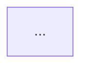

# code-flow-visualizer 設計書

| 項目 | 値 |
|---|---|
| ステータス | 実装完了（2026-07-10、ウォークスルー3件通過。mermaid-cliはroot環境でChromeサンドボックスエラーとなり目視チェックリスト経路で検証、SKILL.mdに既知の回避策を追記。/plugin install確認はユーザー実機側で必要） |
| 種別 | スキル |
| 優先度 | Tier F-3 |
| 実装モデル | Sonnet 5（推奨 effort: high） |
| 依存する設計書 | なし |
| 依存する既存スキル | code-review-adr（責務境界のみ。呼び出し依存はしない）、repo-skill-creator（スキル作成手順） |
| 外部依存 | なし（Mermaid のレンダリングは閲覧側の GitHub/エディタが担う。生成側に外部依存はない） |

## 計画ゲート5項目（着手前回答）

1. **この設計が失敗する最も確率の高いパターン（3つ以上）**
   - (a) 入力粒度を絞れず「リポジトリ全体を図にして」に応じてしまい、巨大で読めない1枚図か、途中で破綻した出力を返す。
   - (b) 生成した Mermaid が構文エラーでレンダリングされず、ユーザーが気づかないまま壊れた成果物を渡す。
   - (c) コードの実挙動ではなく「関数名からの推測」で矢印を引き、実際の呼び出し関係と食い違う図を作る（もっともらしい誤り）。
2. **スコープの境界線 —「ついでにやりそうで、やらないこと」**
   §2.2 に列挙。核心は「レビュー・品質指摘をしない」「決定記録（ADR）を書かない」「図を自動コミットしない」「実行トレース（動的解析）をしない」。
3. **完成条件を実装者が単独で真偽判定できる文で書けるか** — 書ける。§3 は全項目を「ファイル存在」「grep」「Mermaid 構文検証コマンドの exit code」「ウォークスルー通過」で判定する形にした。
4. **実装者が最初に詰まる箇所** — 「入力粒度の確定フロー」と「Mermaid で表現しきれない複雑さの degrade 手順」。両方 §6・§11 に先回りで手順化した。
5. **この作業は本当に必要か（既存で代替できないか）** — code-review-adr は「判断・記録」、requirements-definition は「要件の構造化」であり、いずれも既存コードの**制御/データフローの可視化**を担当しない。重複なし。よって必要。

## 1. 目的・背景（Why）

未知のコードベースに入った人（インターン・新規参画者）が、処理の流れを追えず全体像を掴むのに時間がかかる。既存スキルは「レビューして判断を記録する（code-review-adr）」「要件を構造化する（requirements-definition）」までで、**既に書かれたコードの制御フロー・データフローを図にして読み手の理解を助ける**役割は存在しない。

本スキルは、指定された**エントリポイント1つ**（関数・APIエンドポイント・CLIコマンド・ファイル）を起点にコードを読み、処理の流れを Mermaid 記法の Markdown 図（既定）または自己完結の単一 HTML 図（要望時）として生成する。IT初心者〜中級者が図だけで流れを追えることを狙う。

ユースケース: ①インターンが未知コードの全体像を掴む ②他人にコードの流れを説明する資料を作る ③自分の実装を後から見返す。

## 2. スコープ

### 2.1 やること

- **入力の受け取りと粒度確定**: エントリポイント（関数名 / APIパス / CLIサブコマンド / ファイルパス / 1ユースケース）を1つ特定する。曖昧または「リポジトリ全体」と言われたら、§6 Step1 の分割提案フローで1フローに絞ってから着手する。
- **コード読解**: エントリポイントから静的にコールグラフ・分岐・ループ・外部I/O（DB/API/ファイル/キュー）をたどる。呼び出し先は既定で深さ3階層まで、または1図あたりノード25個までのいずれか先に達した時点で打ち切り、打ち切り点を「詳細は別図」ノードとして残す。
- **図の生成（2種の記法を使い分け）**:
  - `flowchart`（制御フロー: 分岐・ループ・早期return）
  - `sequenceDiagram`（複数コンポーネント/サービス間の呼び出し順とデータの流れ）
  どちらを使うかは §11 の選択ルールで確定。
- **出力形式**:
  - (a) **既定**: Mermaid コードブロックを含む Markdown 1ファイル。図の下に「登場する主な関数・ファイルの対応表」と「読み方の注記」を付ける。
  - (b) **要望時のみ**: 自己完結の単一 HTML（Mermaid をインライン埋め込み、外部CDN禁止、この環境の Artifact 制約と同じ）。
- **成果物の検証**: 生成した Mermaid を構文検証し、壊れていないことを確認してから提示する（§10）。
- **成果物の置き場**: 既定は**作業ディレクトリ**（`./flows/` 未作成なら作成）に生成し、リポジトリへのコミットはしない。コミット/所定ディレクトリ格納はユーザーが明示的に希望した場合のみ（§11）。

### 2.2 やらないこと（明示的スコープ外）

- **コードレビュー・品質指摘・バグ検出**（code-review-adr の担当。本スキルは「良し悪しを言わず、流れを描くだけ」。図中に「ここはバグ」等の評価を書かない）。
- **アーキテクチャ決定の記録（ADR）**（code-review-adr の担当。本スキルは意思決定を残さない）。
- **要件定義・仕様の構造化**（requirements-definition の担当）。
- **動的解析・実行トレース・カバレッジ計測**（YAGNI。実行せず静的読解のみ。ランタイム挙動が要る場合は「静的解析の限界」として注記し実行はしない）。
- **リポジトリ全体を1枚で網羅する図**（読めないため方針として拒否。必ずエントリポイント単位に分割する）。
- **図の自動コミット・自動PR**（生成物は既定で作業ディレクトリ。勝手にリポジトリを汚さない）。
- **図の自動更新・CI連携・コード変更追従の常駐化**（YAGNI。都度生成のみ。ループ化が要るなら loop-engineering の担当）。
- **UML 全記法対応（クラス図・ER図・状態遷移図など）**（YAGNI。初版は flowchart と sequenceDiagram の2種のみ。他記法は3件以上要望が出たら再検討）。
- **Mermaid 以外の作図ツール（PlantUML / Graphviz / draw.io 等）対応**（YAGNI。Mermaid が GitHub 標準レンダリング対応で追加依存ゼロのため一本化）。
- **多言語横断の自動言語判定基盤の作り込み**（YAGNI。読解は Claude の汎用コード読解力に委ね、専用パーサは作らない）。

## 3. 完成条件（Definition of Done）

- [ ] `plugins/code-flow-visualizer/skills/code-flow-visualizer/SKILL.md` と `plugins/code-flow-visualizer/.claude-plugin/plugin.json` が存在する。
- [ ] `python scripts/validate_skills.py` が exit 0 で終わる。
- [ ] `.claude-plugin/marketplace.json` の `plugins` 配列に `"name": "code-flow-visualizer"` のエントリがある（`grep -c '"name": "code-flow-visualizer"' .claude-plugin/marketplace.json` が 1 以上）。
- [ ] SKILL.md に次の文字列が全て含まれる（grep で確認）: `flowchart`、`sequenceDiagram`、`エントリポイント`、`degrade`（または「縮退」）、`作業ディレクトリ`、`mermaid`。
- [ ] SKILL.md に「入力粒度確定フロー」「記法選択ルール」「Mermaid 表現限界時の縮退手順」「成果物の置き場ルール」の4見出しが存在する。
- [ ] Mermaid 構文検証手順が SKILL.md に明記され、検証コマンド例（`npx -y @mermaid-js/mermaid-cli` によるレンダリング、または CDN 不可環境向けの目視チェックリスト）が書かれている。
- [ ] ウォークスルー3件通過（§10）: SKILL.md だけを読んだ Claude が、①関数指定 ②APIエンドポイント指定 ③「全体を図にして」（→分割提案に落ちる）の各依頼で、粒度確定→読解→記法選択→図生成→構文検証→作業ディレクトリ出力 の順に動けること。
- [ ] `/plugin install` → `/plugin list` で本スキルが表示されるまで確認済み（README の完了定義）。

## 4. 成果物の構成（ファイルレイアウト）

```
plugins/code-flow-visualizer/
├── .claude-plugin/plugin.json
└── skills/code-flow-visualizer/
    ├── SKILL.md
    └── templates/
        ├── flow-markdown.md        # Mermaid入りMarkdownの出力テンプレート
        └── flow-standalone.html    # 自己完結HTMLの出力テンプレート（外部CDN禁止・インラインのみ）
docs/designs/08-code-flow-visualizer.md   # 本書
.claude-plugin/marketplace.json           # エントリ追記
```

生成される成果物（本スキル実行時。リポジトリには含めない）:
```
./flows/<entrypoint-slug>.md      # 既定出力
./flows/<entrypoint-slug>.html    # (b) 要望時のみ
```

## 5. データ構造

### 5.1 Markdown 出力テンプレート（`templates/flow-markdown.md`・確定）

```markdown
# 処理フロー: <エントリポイント名>

- 対象: <ファイルパス:行 / 関数名 / APIパス>
- 粒度: <control-flow | sequence>
- 読解範囲: 深さ<N>階層 / ノード<M>個（打ち切り理由: <深さ上限 | ノード上限 | I/O境界>）
- 生成日: YYYY-MM-DD
- 注記: この図は静的読解に基づく。実行時の分岐確率・データ内容は反映しない。

## フロー図



## 登場要素の対応表

| ノード | 実体（file:line） | 役割 |
|---|---|---|
| A | src/... | ... |

## 読み方

- 菱形 = 分岐、二重枠 = 外部I/O（DB/API/ファイル）、破線 = 別図に続く（本図の範囲外）
- <その他、図固有の注記>
```

### 5.2 HTML 出力テンプレート（`templates/flow-standalone.html`・確定要件）

- `<!doctype html>` から始まる完全な単一ファイル。
- Mermaid のレンダラは**インラインに埋め込む**（外部CDNの `<script src>` を使わない）。実装時、Mermaid の UMD ビルドを取得してテンプレートにインライン同梱するか、CDN取得不可のためインライン化できない場合は「HTML出力は Mermaid をレンダリング済みSVGとしてインライン埋め込みする方式に切り替える」ことを §11 のルールで確定。
- CSP は Artifact 制約と同じ想定（外部ホストへの一切のリクエスト禁止）。
- ライト/ダーク両対応、横スクロールはコンテナ内に閉じる。

### 5.3 該当なし

frontmatter を持つ永続レコード等のデータストアは持たない（本スキルは都度生成で状態を蓄積しない）。

## 6. 処理フロー

**Step 1（入力粒度の確定）**: 入力→判定→出力。
- 入力: ユーザーの依頼（対象コードの指定）。
- 判定:
  - 関数/メソッド1つ、APIパス1つ、CLIサブコマンド1つ、ファイル1つ、明確な1ユースケース → そのまま採用。
  - 「リポジトリ全体」「このディレクトリ全部」「ぜんぶ」など粒度が広すぎる → **着手前に分割提案**。エントリポイント候補（`main`/ルーティング定義/公開API/CLI定義/`README` 記載の入口）を最大5件列挙し、「まずどの1フローから図にするか」をユーザーに選ばせる。
  - 対象が特定できない → 対象ファイル/関数を質問する（推測で描き始めない）。
- 出力: 確定した単一エントリポイント。

**Step 2（読解）**: エントリポイントから静的にたどる。分岐・ループ・早期return・外部I/O を記録。深さ3階層 or ノード25個で打ち切り、打ち切り点を「別図に続く」ノードとして残す。呼び出し先が不明（動的ディスパッチ・DI・リフレクション）な箇所は推測で矢印を引かず「動的呼び出し（解決先不明）」ノードにする。

**Step 3（記法選択）**: §11 の記法選択ルールで `flowchart` か `sequenceDiagram` を決定。

**Step 4（図生成）**: 該当テンプレート（§5.1 / §5.2）に流し込む。ノード対応表と読み方注記を必ず付ける。

**Step 5（構文検証）**: §10 の手順で Mermaid が壊れていないことを確認。壊れていれば修正して再検証（提示前に必ず1回は通す）。

**Step 6（出力）**: 既定は `./flows/<slug>.md` に保存しチャットにも表示。(b) HTML は要望時のみ追加生成。リポジトリへのコミット/所定ディレクトリ格納は §11 に従いユーザー確認後のみ。

**分岐**: 図が Mermaid の表現限界を超える（§7・§11）場合、Step 4 内で縮退（degrade）手順に入る。

## 7. エッジケース

| ケース | 期待挙動 |
|---|---|
| 「リポジトリ全体を図にして」 | 1枚で描かない。Step1 の分割提案フローでエントリポイント候補を最大5件提示し、1フローを選ばせる |
| 対象が巨大（深さ/ノード上限超過） | 上限で打ち切り、打ち切り点を「別図に続く」ノード（破線）にする。続きは別ファイルの図として、要望があれば追加生成 |
| Mermaid で表現しきれない複雑さ（クロスする多数の矢印・並行分岐の錯綜） | §11 の縮退手順: ①subgraph でグルーピング ②枝を別図に分割 ③flowchart→sequenceDiagram へ変更 ④それでも不可なら Mermaid をあきらめ「番号付きステップ箇条書き + 補足文」で出力し、その旨を注記 |
| 生成した Mermaid が構文エラー | 提示しない。修正して再検証。npx が使えない環境では §10 の目視チェックリストで確認 |
| 動的呼び出し・リフレクション・DIで呼び出し先が静的に不明 | 推測で矢印を引かず「動的呼び出し（解決先不明）」ノードにし、注記に「静的解析の限界」と明記 |
| コードが読めない（対象ファイルが存在しない/空） | 図を作らず、対象の再指定を求める |
| HTML 出力で Mermaid ランタイムを外部CDNから取れない | §5.2 のとおり、レンダリング済みSVGをインライン埋め込みする方式に切り替える（外部リクエストを一切発生させない） |
| 生成物をコミットしてほしいと言われた | 置き場（`docs/flows/` 等）と、生成物を「実データ扱いでコミットするか作業ディレクトリ止まりか」をユーザーに確認してから従う（§11） |

## 8. 失敗シナリオとレッドチーム所見

| # | 失敗シナリオ | 早期警報サイン | 設計上の対策 |
|---|---|---|---|
| 1 | 入力粒度を絞れず巨大な1枚図/破綻出力を返す | 依頼に単一エントリポイントが無いのに図生成に進んでいる。ノード数が25超 | §6 Step1 の分割提案フローを着手前ゲートにする。深さ3/ノード25の上限を SKILL.md に確定値で記載し、超過時は打ち切りを義務化 |
| 2 | 壊れた Mermaid をユーザーが気づかず受領する | 出力Markdownに構文検証を通した記載がない | §10 の構文検証を Step5 として必須化。提示前に最低1回レンダリング検証（不可環境は目視チェックリスト）。完成条件に検証手順の記載を含める |
| 3 | 関数名からの推測で実際と食い違う矢印を引く（もっともらしい誤り） | 図中に、コードを読んだ根拠（file:line）が対応表に無いノードがある | 全ノードに `file:line` の対応表を義務化（§5.1）。静的に解決できない呼び出しは「動的呼び出し（解決先不明）」ノードにし推測禁止（§7） |

## 9. 実装手順（Sonnet 向けタスク分割）

1. **スキル雛形作成** — repo-skill-creator の手順で `plugins/code-flow-visualizer/` を作成（plugin.json + SKILL.md の骨格）。完了条件: `python scripts/validate_skills.py` が exit 0。
2. **テンプレート作成** — `templates/flow-markdown.md`（§5.1 の確定内容そのまま）と `templates/flow-standalone.html`（§5.2 の要件を満たす自己完結HTML）を作る。完了条件: `templates/` に2ファイル存在し、HTML に外部ホストへの `src=`/`href=`/`fetch` が含まれない（`grep -nE 'https?://' templates/flow-standalone.html` が0件）。
3. **SKILL.md 執筆** — §2〜§7・§11 の内容（入力粒度確定フロー / 記法選択ルール / 縮退手順 / 出力・置き場ルール / 構文検証手順）を全て収録。description の発動トリガーは「処理フローを図にして」「コードの流れを可視化」「フローチャートにして」「この関数の流れを図解」「シーケンス図にして」「code flow」「visualize code」等。完了条件: §3 の grep 条件と4見出し存在チェックが全て真、ウォークスルー3件通過。
4. **marketplace.json 追記 + push + 導入確認** — `.claude-plugin/marketplace.json` にエントリ追加。完了条件: `/plugin install` → `/plugin list` に表示。

順序依存: 1→2→3→4（3 は 2 のテンプレートを参照するため後）。

## 10. テスト計画

- **機械検証**: `python scripts/validate_skills.py` を実行し exit 0 を確認。
- **grep 検証**: §3 の文字列・見出し・marketplace エントリを grep で確認。
- **Mermaid 構文検証（成果物側の検証手順であり、実装時にも1件実施）**: 生成した `.md` 内の Mermaid を `npx -y @mermaid-js/mermaid-cli -i flow.md -o flow.svg` でレンダリングし exit 0 を確認。npx/ネットワーク不可環境では、SKILL.md に載せる目視チェックリスト（①`flowchart TD`/`sequenceDiagram` の宣言行がある ②全ノードIDが英数字 ③矢印 `-->`/`->>` の左右にノードがある ④subgraph に対応する end がある ⑤日本語ラベルは `["..."]` で囲む）で代替。
- **ウォークスルー3件**: ①「この関数の処理フローを図にして」（関数指定→flowchart） ②「`POST /orders` の流れをシーケンス図にして」（APIパス→sequenceDiagram） ③「このリポジトリ全体を図にして」（→分割提案フローに落ち、エントリポイント選択を促す）。各件で Step1→6 の順に動くことを確認。
- **ネガティブ確認**: 「このコードの品質をレビューして」に対し、本スキルが発動せず code-review-adr に委ねること（本スキルは可視化のみで評価しない）。

## 11. 実装時判断ルール

- **記法選択ルール（確定）**: 単一コンポーネント内の分岐・ループ・処理順を描くなら `flowchart TD`。複数のコンポーネント/サービス/レイヤー（クライアント⇄API⇄DB 等）をまたぐ呼び出し順とデータの往復を描くなら `sequenceDiagram`。両方の性質があるなら既定は `flowchart`、ユーザーが「シーケンス図で」と言えば `sequenceDiagram`。
- **縮退（degrade）手順（確定）**: 図が読めなくなる（矢印が錯綜/ノード25超）と判断したら順に試す — ①`subgraph` でグルーピング → ②枝を別図（別ファイル）に分割し「別図に続く」破線ノードで繋ぐ → ③`flowchart`→`sequenceDiagram` に記法変更 → ④それでも不可なら Mermaid を使わず「番号付きステップ箇条書き + 補足文」で出力し、Mermaid 化できなかった旨を注記する。
- **成果物の置き場（確定）**: 既定は作業ディレクトリ `./flows/`。リポジトリへのコミットはしない（生成物であり、コードと二重管理になるとすぐ腐るため）。ユーザーが「コミットして/`docs/` に置いて」と明示したときのみ、置き場を確認して従う。CLAUDE.md の常時適用スキル（token-saver 等）とは無関係に、この置き場ルールは固定。
- **HTML 出力の Mermaid 埋め込み（確定）**: 外部CDN禁止。Mermaid ランタイムをインライン同梱できるならそれを使い、取得不可なら「レンダリング済みSVGをインライン埋め込み」に切り替える。いずれの場合も生成HTMLは外部ホストへ一切リクエストしない。
- **深さ/ノード上限（確定値）**: 深さ3階層、1図あたりノード25個。どちらか先に達したら打ち切る。ユーザーが上限変更を指示したら従う。
- **推測禁止（確定）**: 静的に呼び出し先が解決できない箇所は矢印を引かず「動的呼び出し（解決先不明）」ノードにする。関数名からの推測でフローを作らない。
- SKILL.md の文体・構成は既存の `code-review-adr` / `document-creation` の SKILL.md に合わせる（「いつ使うか」「ワークフロー」「エッジケース」「前提セットアップ」の見出し構成）。
- 発動境界の1行を description か本文に明記する: 「品質の良し悪しの指摘は code-review-adr、決定の記録は code-review-adr の ADR、要件の構造化は requirements-definition。本スキルは既存コードの流れの**可視化のみ**を担当する」。

## 12. 未解決事項（ユーザー確認待ち）

- 既定出力を Markdown+Mermaid 単独とするか、毎回 HTML も併せて出すか。本設計は「既定=Markdownのみ、HTMLは要望時」で確定した。運用してみて「毎回HTMLも欲しい」となれば §5.2 を既定化する。
- 本スキルを CLAUDE.md の常時適用リストに載せるか（明示発動のままにするか）。本設計は「明示発動のみ」を前提とする（可視化は都度依頼される性質のため）。
- 生成物 `./flows/` を `.gitignore` に追加するか（リポジトリでの実運用時にユーザーが判断）。
