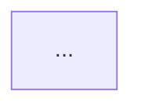

# 処理フロー: <エントリポイント名>

- 対象: <ファイルパス:行 / 関数名 / APIパス>
- 粒度: <control-flow | sequence>
- 読解範囲: 深さ<N>階層 / ノード<M>個（打ち切り理由: <深さ上限 | ノード上限 | I/O境界>）
- 生成日: YYYY-MM-DD
- 注記: この図は静的読解に基づく。実行時の分岐確率・データ内容は反映しない。

## フロー図

## 登場要素の対応表

| ノード | 実体（file:line） | 役割 |
|---|---|---|
| A | src/... | ... |

## 読み方

- 菱形 = 分岐、二重枠 = 外部I/O（DB/API/ファイル）、破線 = 別図に続く（本図の範囲外）
- <その他、図固有の注記>
